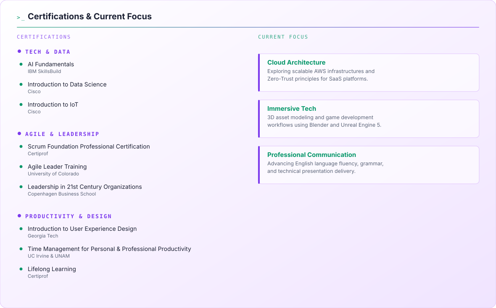

<picture>
  <source media="(prefers-color-scheme: dark)" srcset="assets/dark.svg" />
  
</picture>

  

<!-- Streak -->
<picture>
  <source media="(prefers-color-scheme: dark)" srcset="https://streak-stats.demolab.com/?user=Cristian2040&background=135%2C0A101F%2C2D1B4E&ring=00E676&fire=B026FF&currStreakLabel=E7EAF2&sideLabels=7C8AA5&dates=7C8AA5&border=3D2E5C&currStreakNum=E7EAF2&sideNums=E7EAF2&v=2" />
  
</picture>

<!-- Stats + Top Langs, lado a lado -->
<picture>
  <source media="(prefers-color-scheme: dark)" srcset="https://github-readme-stats-xi-liart-46srfjavj9.vercel.app/api?username=Cristian2040&border_radius=10&hide_rank=true&show_icons=true&bg_color=135%2C0A101F%2C2D1B4E&title_color=00E676&text_color=E7EAF2&icon_color=B026FF&border_color=3D2E5C&v=2" />
  
</picture><picture>
  <source media="(prefers-color-scheme: dark)" srcset="https://github-readme-stats-xi-liart-46srfjavj9.vercel.app/api/top-langs/?username=Cristian2040&border_radius=10&layout=compact&bg_color=135%2C0A101F%2C2D1B4E&title_color=00E676&text_color=E7EAF2&border_color=3D2E5C&v=2" />
  
</picture>
  

<!-- Contribution snake -->
<picture>
  <source media="(prefers-color-scheme: dark)" srcset="https://raw.githubusercontent.com/Cristian2040/Cristian2040/output/github-contribution-grid-snake-dark.svg" />
  
</picture>

  

<!-- Badges -->
<a href="mailto:hbcristian20@gmail.com">
  <picture>
    <source media="(prefers-color-scheme: dark)" srcset="https://img.shields.io/badge/-Email-0A101F?style=for-the-badge&logo=gmail&logoColor=E7EAF2" />
    
  </picture>
</a>

 

<!-- Featured Projects & Organization -->
<table width="100%" border="0" cellspacing="0" cellpadding="0" style="background-color:#0A101F;">
  <tr>
    <td colspan="2">
      

        &gt;_ ORGANIZATION.INFO
      

    </td>
  </tr>
  <tr>
    <td colspan="2">
      <table width="100%" border="0" cellspacing="0" cellpadding="14">
        <tr>
          <td width="100%" style="border:1px solid #FBBF24;border-radius:6px;">
            <a href="https://sofccey.onrender.com" style="text-decoration:none;">
              SOFCEY
            </a>
             
            
              Co-fundador &amp; Software Developer. Creadores de "Singly" — un guante inteligente para traducir lenguaje de señas.
            
              
            
            
          </td>
        </tr>
      </table>
    </td>
  </tr>

  <tr>
    <td colspan="2">
      

        &gt;_ FEATURED.PROJECTS
      

    </td>
  </tr>

  <tr>
    <td width="50%" valign="top" style="padding:8px;">
      <table width="100%" border="0" cellspacing="0" cellpadding="14" style="border:1px solid #1C2540;border-radius:6px;">
        <tr><td>
          <a href="https://github.com/Cristian2040/CloudStore-360" style="text-decoration:none;">
            CloudStore 360
          </a>
           
          
            Progressive web app para gestión de inventario, ventas y control de punto de venta en tiendas locales, con integración de hardware.
          
            
          
          
          
          
            
          <a href="https://sistema-tienda-local.web.app" style="font-family:'JetBrains Mono',monospace;font-size:11px;color:#22D3EE;text-decoration:none;">&#8599; Live Demo</a>
        </td></tr>
      </table>
    </td>
    <td width="50%" valign="top" style="padding:8px;">
      <table width="100%" border="0" cellspacing="0" cellpadding="14" style="border:1px solid #1C2540;border-radius:6px;">
        <tr><td>
          <a href="https://hoki-539322039535.us-east1.run.app" style="text-decoration:none;">
            HOKI
          </a>
           
          
            Plataforma web impulsada por IA para potenciar pequeños negocios: identidad, marketing, inventario y finanzas.
          
            
          
          
          
          
          
          
        </td></tr>
      </table>
    </td>
  </tr>

  <tr>
    <td width="50%" valign="top" style="padding:8px;">
      <table width="100%" border="0" cellspacing="0" cellpadding="14" style="border:1px solid #1C2540;border-radius:6px;">
        <tr><td>
          <a href="https://github.com/Cristian2040/global-store-ia" style="text-decoration:none;">
            Global-Store AI
          </a>
           
          
            Plataforma SaaS que conecta tiendas locales, clientes y proveedores.
          
            
          
          
            
          <a href="https://globalstore.duckdns.org" style="font-family:'JetBrains Mono',monospace;font-size:11px;color:#22D3EE;text-decoration:none;">&#8599; Live Demo</a>
        </td></tr>
      </table>
    </td>
    <td width="50%" valign="top" style="padding:8px;">
      <table width="100%" border="0" cellspacing="0" cellpadding="14" style="border:1px solid #1C2540;border-radius:6px;">
        <tr><td>
          <a href="https://medi-kit-539322039535.us-east1.run.app" style="text-decoration:none;">
            Medi-Kit PWA
          </a>
           
          
            Aplicación intuitiva para organizar horarios de medicamentos y recibir recordatorios diarios, con almacenamiento del lado del cliente.
          
            
          
          
          
          
          
        </td></tr>
      </table>
    </td>
  </tr>

  <tr>
    <td width="50%" valign="top" style="padding:8px;">
      <table width="100%" border="0" cellspacing="0" cellpadding="14" style="border:1px solid #1C2540;border-radius:6px;">
        <tr><td>
          <a href="#" style="text-decoration:none;">
            Medi-Kit Android
          </a>
           
          
            Aplicación nativa de Android para recordatorios médicos, con alarmas en segundo plano y base de datos local (Room). Todavía en desarrollo.
          
            
          
          
          
        </td></tr>
      </table>
    </td>
    <td width="50%" valign="top" style="padding:8px;">
      <table width="100%" border="0" cellspacing="0" cellpadding="14" style="border:1px solid #1C2540;border-radius:6px;">
        <tr><td>
          <a href="https://github.com/FelipeEstrellaPro/Jardin-Botanico-Flutter" style="text-decoration:none;">
            Aplicación Jardín Botánico — UT San Juan
          </a>
           
          
            Aplicación de gestión de invernadero. Terminada, pendiente de despliegue.
          
           
          &#9733; Team Project — repo de Felipe Estrella
            
          
          
          
        </td></tr>
      </table>
    </td>
  </tr>

</table>

 

<!-- Certifications & Current Focus -->

  <picture>
    <source media="(prefers-color-scheme: dark)" srcset="assets/certifications-dark.svg" />
    
  </picture>

